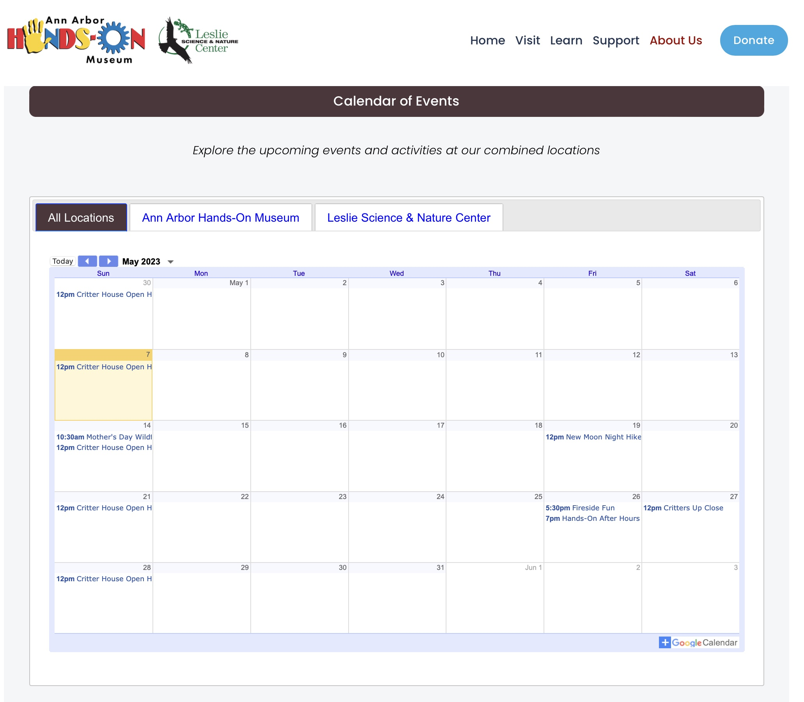

### Calendar of Events

The Calendar of Events custom function grabs CSV data from "reference-data/calendars" blog entry for the list of calendars, Google calendar id and links.   It also gets reference data from "refeerence-data/museum-list", which identifies the museums that are currently being included/hidden.   Calendars are organized and displayed in a tabbed list.  In addition to each museum calendar, the combination of all included calendars is displayed as the first tabbed item called "All Locations".  test

The Calendar of Events block is emplimented by adding a code block to the page with the following:

**Code block for Calendar of Events**
```
<script>
$(document).ready(function() {
  collectionControl(
    '#calendarsOut',
    '',
    'calendars',
    {activetab: 1,
     single: false,
     openFirst: false,
     collapsable: false,
     collapsed: false,
     title: "View Calendars",
     showPrint: false,
     showTabs: false,
     showTitle: false,
     showName: false,
     showNav: true,
     showDate: true,
     showTz: true,
     mode: "MONTH",
     showCalendars: false}
  );
})
</script>
<div id="calendarsOut"></div>
```

**Usage:**

*collectionControl(Selector, Collection Slug, Display Type, Attributes)*

**Parameters:**

<table class="ws-table-all notranslate">
  <tbody>
    <tr class="tableTop">
     <td style="width:120px">Parameter</td>
     <td>Description</td>
    </tr>
    <tr>
      <td>Selector</td>
      <td>Required.<br>jQuery selector identification where the resulting html code will be generated.  Note that the selector must be unique on the page.</td>
    </tr>
    <tr>
      <td>Collection Slug</td>
      <td>No defined collection is needed, leave blank.</td>
    </tr>
    <tr>
      <td><em>Display Type</em></td>
      <td>Required.<br>Identifies the display type requested.  For Calendar of Events must be "**calendars**".  These are case sensitive parameters values. </td>
    </tr>
    <tr>
      <td><em>Attributes</em></td>
      <td>Optional.<br>Identifies parameters to override default values.  The parameters are passed in a object array of key/value pairs.  Each display type has different default values as described below. </td>
    </tr>
  </tbody>
</table>

**Attributes:**

All attributes are optional, the defaults are defined.

<table class="ws-table-all notranslate">
  <tbody>
    <tr class="tableTop">
     <td style="width:120px">Attribute</td>
     <td>Description</td>
     <td>Default</td>
    </tr>
    <tr>
      <td>Collapasble</td>
      <td>
        <ul>
          <li>True=Can be collapsed or expanded.</li>
          <li>False=Not collapsable.</li>
        </ul>
      </td>
      <td>True</td>
    </tr>
    <tr>
      <td><em>Collapsed</em></td>
      <td>
      Collapsable must be set to true, otherwise this paramter is ignored.
        <ul>
          <li>True=Initially collapsed.</li>
          <li>False=Initially expanded.</li>
        </ul>
      </td>
      <td>False</td>
    </tr>
    <tr>
      <td>openfirst</td>
      <td>
      Determins if the first accordian group is initially expanded or not
        <ul>
          <li>True=Initially collapsed.</li>
          <li>False=Initially expanded.</li>
        </ul>
      </td>
      <td>False</td>
    </tr>
    <tr>
      <td>title</td>
      <td>The title that will be displayed if collapsable</td>
      <td>View Frequently Asked Questions</td>
    </tr>
    <tr>
      <td>activetab</td>
      <td>Expecting a number from 1-4 indicating the museum.
        <ul>
          <li>1=Ann Arbor Hands On</li>
          <li>2=Leslie Science</li>
          <li>3=Yankee Air Museum</li>
          <li>4=Challenger Learning center</li>
        </ul>
      </td>
      <td>1</td>
    </tr>
    <tr>
      <td>Single</td>
      <td>
        <ul>
          <li>True=Show only the active museum tab.</li>
          <li>False=All museums.</li>
        </ul>
      </td>
      <td>False</td>
    </tr>
    <tr>
      <td>showPrint</td>
      <td>
        <ul>
          <li>True=Google parameter to show print button</li>
          <li>False=Hide print button.</li>
        </ul>
      </td>
      <td>False</td>
    </tr>
    <tr>
      <td>showTabs</td>
      <td>
        <ul>
          <li>True=Google parameter to show tabs button</li>
          <li>False=Hide tabs button.</li>
        </ul>
      </td>
      <td>False</td>
    </tr>
    <tr>
      <td>showTitle</td>
      <td>
        <ul>
          <li>True=Google parameter to show title</li>
          <li>False=Hide title.</li>
        </ul>
      </td>
      <td>False</td>
    </tr>
    <tr>
      <td>showName</td>
      <td>
        <ul>
          <li>True=Google parameter to show name</li>
          <li>False=Hide name.</li>
        </ul>
      </td>
      <td>False</td>
    </tr>
    <tr>
      <td>showNav</td>
      <td>
        <ul>
          <li>True=Google parameter to show Nav</li>
          <li>False=Hide nav.</li>
        </ul>
      </td>
      <td>False</td>
    </tr>
    <tr>
      <td>showDate</td>
      <td>
        <ul>
          <li>True=Google parameter to show Date</li>
          <li>False=Hide date.</li>
        </ul>
      </td>
      <td>False</td>
    </tr>
    <tr>
      <td>showTz</td>
      <td>
        <ul>
          <li>True=Google parameter to show Tz</li>
          <li>False=Hide tz.</li>
        </ul>
      </td>
      <td>False</td>
    </tr>
    <tr>
      <td>mode</td>
      <td>
        <ul>
          <li>Google parameter to set mode (MONTH, AGENDA)</li>
        </ul>
      </td>
      <td>False</td>
    </tr>
  </tbody>
</table>

**Return Value:**

None

**Reference Data**

*reference-data blog: calendars (markdown block)*

*Markdown Block* is a SquareSpace markdown block.  The is a standard CSV file, with the first row
begin a column header row (Museum,Calendar ID,Page Link).   This row is ignored in processing 
the data.  

Where **MuseumName** is one of:
- unity
- aahom
- leslie
- experience
- challenger
- camp

Where **Calendar ID** is the Google calendar ID for the calendar assigned to the museum

Where **Page Link** is the page link that will be shown in the calendar footer. 

**Example:**

```
Museum,Calendar ID,Page Link
aahom,YWFob20yMjBAZ21haWwuY29t,/aahom
leslie,aHJmdWlndGk2ZDN2c2xlY2N0M2xsaGNmaThAZ3JvdXAuY2FsZW5kYXIuZ29vZ2xlLmNvbQ,/leslie-center
```
**Overrides:**

You can dynamically override *ActiveTab* by adding a parameter to the linking url as:

```
?tab=n  (where n is a number from 1-4, see ActiveTab below)
```

**Example Screenshot**

{: .theImage}
