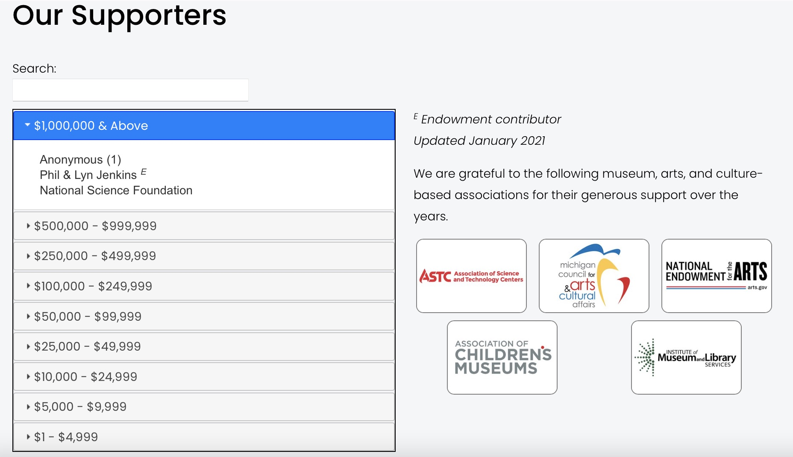

### Donor Wall

Lists of donors in accordian style by defined breakpoints.

**Used On Pages**

*Support -> Our Supporters*

**Usage**

*collectionControl(Selector, Collection Slug, Display Type, Attributes)*

**Parameters:**

<table class="ws-table-all notranslate">
  <tbody>
    <tr class="tableTop">
     <td style="width:120px">Parameter</td>
     <td>Description</td>
    </tr>
    <tr>
      <td><em>Selector</em></td>
      <td>Required.<br>jQuery selector identification where the resulting html code will be generated.  Note that the selector must be unique on the page.</td>
    </tr>
    <tr>
      <td><em>Collection Slug</em></td>
      <td>No defined collection is needed, leave blank.</td>
    </tr>
    <tr>
      <td><em>Display Type</em></td>
      <td>Required.<br>Identifies the display type requested.  For donors must be "donorWall".  These are case sensitive parameters. </td>
    </tr>
    <tr>
      <td><em>Attributes</em></td>
      <td>Optional.<br>Identifies parameters to override default values.  The parameters are passed in a object array of key/value pairs.  Each display type has different default values as described below. </td>
    </tr>
  </tbody>
</table>

**Attributes:**

All attributes are optional, the defaults are defined.

<table class="ws-table-all notranslate">
  <tbody>
    <tr class="tableTop">
     <td style="width:120px">Attribute</td>
     <td>Description</td>
     <td>Default</td>
    </tr>
    <tr>
      <td><em>Collapasble</em></td>
      <td>
        <ul>
          <li>True=Can be collapsed or expanded</li>
          <li>False=Not collapsable</li>
        </ul>
      </td>
      <td>True</td>
    </tr>
    <tr>
      <td>Collapsed</td>
      <td>
      Collapsable must be set to true, otherwise this paramter is ignored.
        <ul>
          <li>True=Initially collapsed</li>
          <li>False=Initially expanded</li>
        </ul>
      </td>
      <td>False</td>
    </tr>
    <tr>
      <td><em>openfirst</em></td>
      <td>
      Determins if the first accordian group is initially expanded or not
        <ul>
          <li>True=Initially collapsed</li>
          <li>False=Initially expanded</li>
        </ul>
      </td>
      <td>False</td>
    </tr>
    <tr>
      <td>title</td>
      <td>The title that will be displayed if collapsable</td>
      <td>title</td>
    </tr>
    <tr>
      <td>breakpoints</td>
      <td>This is an array of integer values which
      defines the breakpoints and minimum value
    to qualify.</td>
    <td>breakpoints: [
    1,1000,5000, 10000, 25000, 50000, 100000, 250000, 500000, 1000000].</td>
    </tr>
  </tbody>
</table>

**Example code block for control**

```
<script>
<script>
$( document ).ready(function() {
  collectionControl(
    '#donorWall',
    '',
    'donorwall',
    {
      collapsable: false,
      collapsed: true,
      title: "This is the title",
      breakpoints:
        [1,1000,5000, 10000, 25000,
        50000, 100000, 250000, 500000, 1000000]
    }
  );
});
</script>
<div id="donorWall"></div>
```

**Reference Data**

*reference-data blog: Donor Wall (code block)*

*reference-data blog: Donor Wall (gallery block)*

*Code Block* is a standard CSV file, including the header row.   All fields are
separated by commas.   Blank lines, and lines where the first field is blank
are ignored.  Columns are Min, Name, Total donors, Endowment, Recent Year.
Rows where the "Min" value is a zero are considered notes and will be placed in the
footnote section.

**CSV Donor File:**

<table class="ws-table-all notranslate">
  <tbody>
    <tr class="tableTop">
     <td style="width:120px">Column</td>
     <td>Description</td>
    </tr>
    <tr>
      <td>Min</td>
      <td>The total donation dollar amount, or the breakpoint amount</td>
    </tr>
    <tr>
      <td>Name</td>
      <td>The donor full name as it should show</td>
    </tr>
    <tr>
      <td>Total donors</td>
      <td>Number of donors in this grouping, normally only used for "Anonymous"</td>
    </tr>
    <tr>
      <td>Endowment</td>
      <td>"Yes", "No" or null.   Yes indicates that this donation is a endowment.</td>
    </tr>
    <tr>
      <td>Recent Year</td>
      <td>Not used at the moment</td>
    </tr>
  </tbody>
</table>

**NOTE about Anonymous**

Anonymous donors are identified by setting the **name** to "**Anonymous**".  All Anonymous donors within a group will be totaled up and presented as a single donor entry with the total number of donors indicated in parentheses. 

...
Anonymous (3) 
...  


**Example Screenshot**

{: .theImage}
