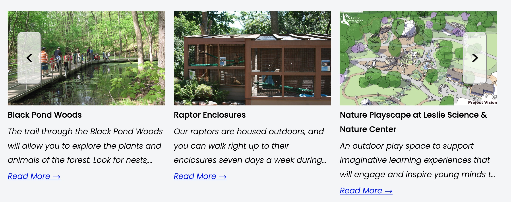
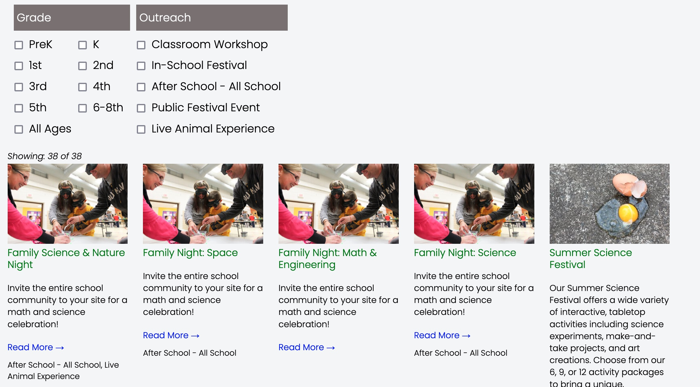
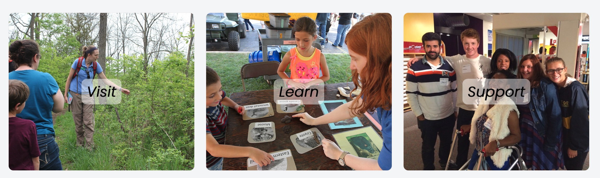
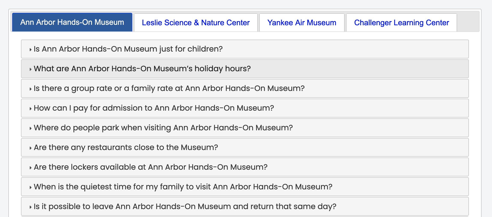
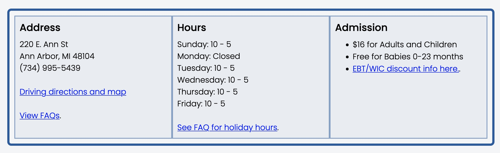
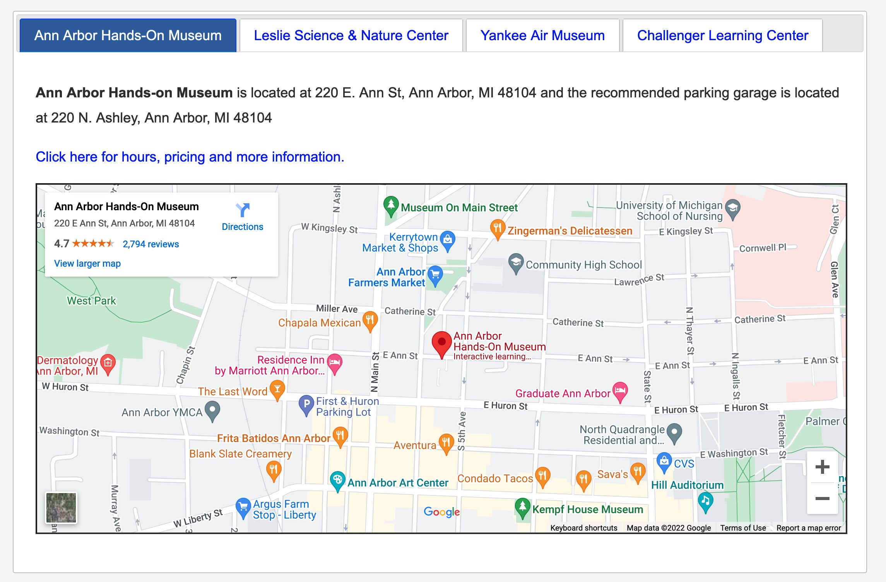
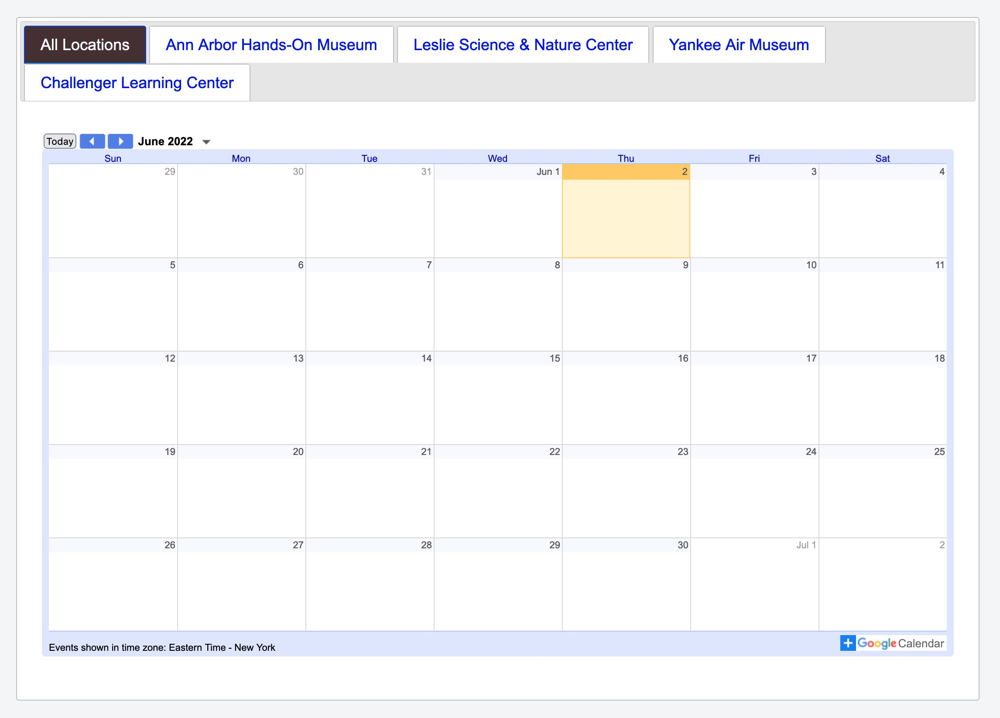
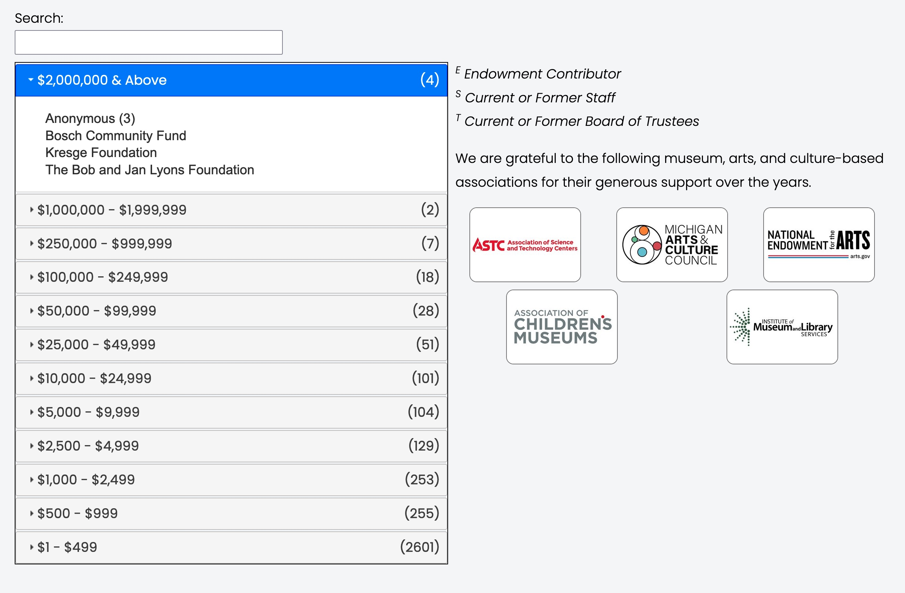
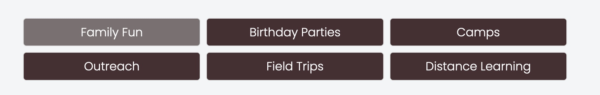
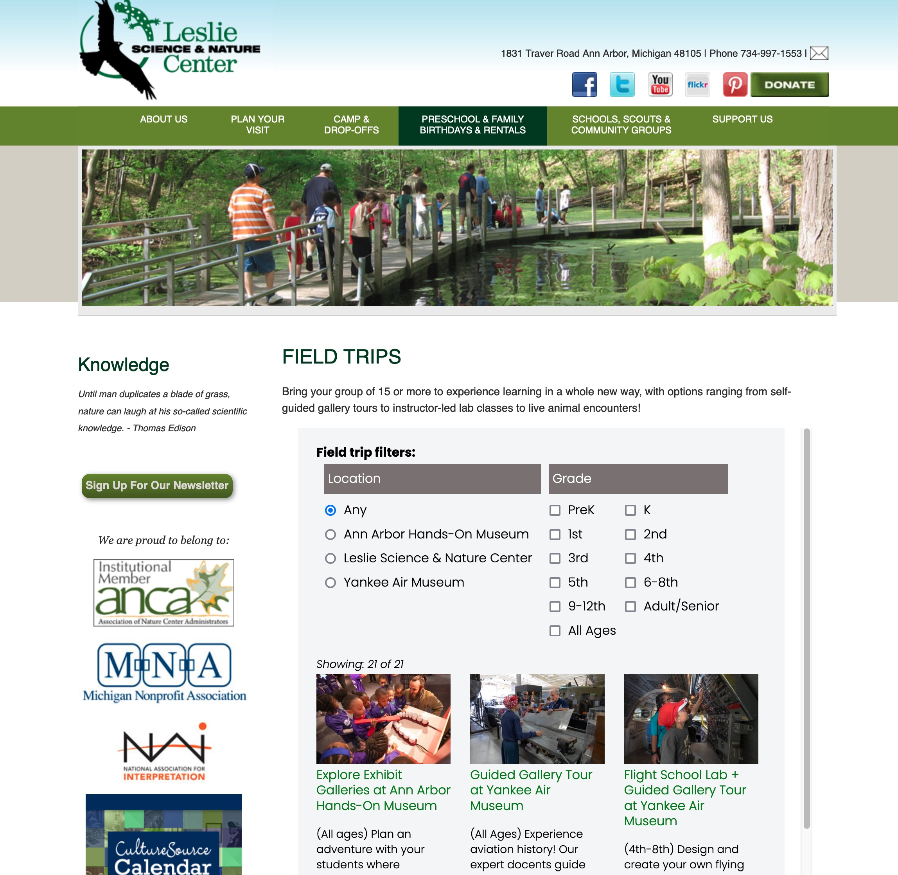

# Components Home

This is a quick review of the tools available in the UIL Toolbox.   These tools generally present data from **SquareSpace Collections**.   Collections are files of either Blogs or Events.

## Carousel

The Carousel is an infinint loop of entries in a collection with previous and next
buttons on the left and right.  The number of items displayed can be defined as an
attribute when calling the carousel function.  Filtering (to limit items) based on SquareSpace categories is also available via attributes. [Learn More about carousels](../components/carousel.html).

{: .theImage}

## Filtered Grid

This will display a SquareSpace collection (blog or events) as a grid with optional
filtering based on defined groups (see reference-data).  [Learn More about grids](../components/grids.html).

{: .theImage}

## Icon Bar

Icon Bars appear either attached to the top header image and/or the bottom footer on
all pages.  The icons displayed are saved in /reference-data/iconbar.  [Learn More about Icon Bars](../components/iconbar_new.html).

{: .theImage}

## Team Members

A list of team members found in the SquareSpace blog “Team Members” can be displayed via the custom function collectionControl by embedding a code block on a page. [Learn More about Team Members](../components/teamboxes.html).

{: .theImage}

## Flex Boxes

Flip Boxes are individual slide shows that flip to the back side when hovered (or clicked on mobile devices).  The backside displays a short excerpt along with a link to the appropriate content.   [Learn More about Flex Boxes](../components/flexboxes.html).

{: .theImage}

## Frequently Asked Questions

The Frequently Asked Questions custom function grabs data from "reference-data/FAQS" blog entry and displays the questions/answers in an accordian style list.  Each museum will have a separate tab, and separate questions based on CSV format data. [Learn More about FAQS](../components/faq.html).

{: .theImage}

## Address/Hours/Admission

{: .theImage}

## Locations

{: .theImage}

## Calendars

{: .theImage}

## Donor Wall

The DonorWall displays donors grouped by total amount of donations in accordion style.  It
also allows searching for donor strings.  Donors are also identified as **Endowment Contributor**, "**Staff**" or "**Trustee**".  [Learn More about Donors Wall](../components/donorwall.html).

{: .theImage}

## Sub Menu

Menu bar for sub-menu items.  These are found on the "Learn" pages to help navigation between learn pages.  On mobile devices the menu is an wrapped in an accordion and compressed by default to save some space.  Content for submenu bar is in a code block
of the SubMenu List reference-data blog.  [Learn More about Submenu Bar](../components/menubar.html).

{: .theImage}

## Embedded Iframe

You can embed a page from the UIL website into the page of a separate website.  When this is done, headers and footers are hidden with "display:none" CSS attribute. Otherwise this is a basic iFrame embed and initial height/width will be honored.  [Learn More about Embedding Iframes](../components/iframe.html).

{: .theImage}