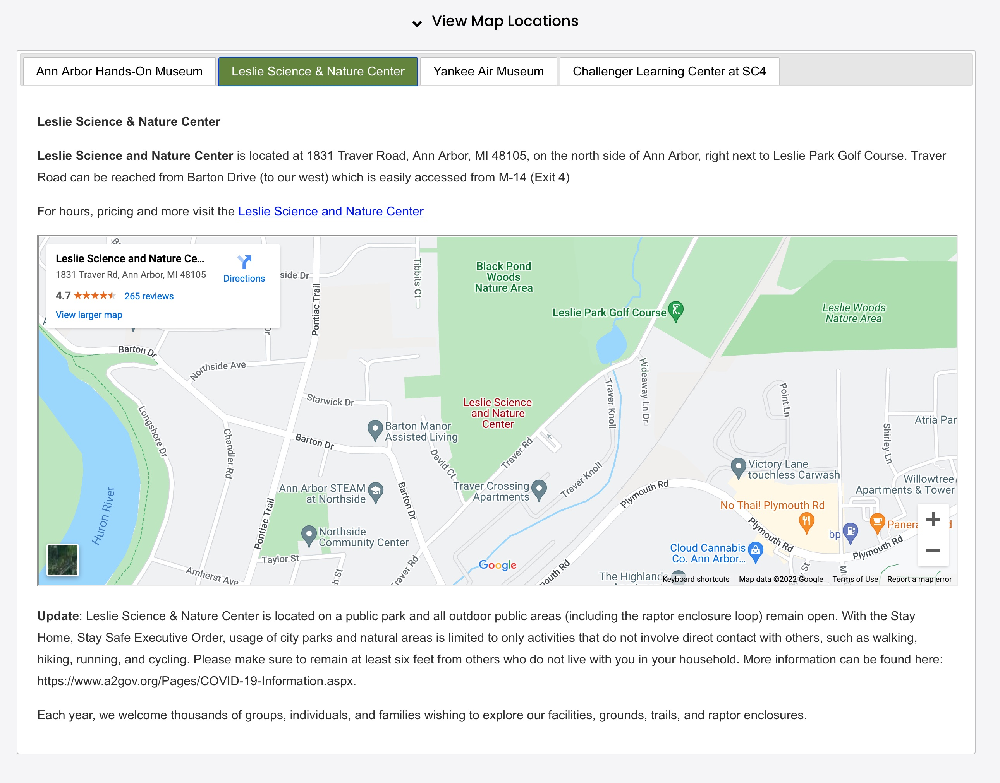

### Map Locations

The map locations custom function grabs data from a Google spreadsheet (Map Locations) and embeds Google maps within tabbed list on the page.  It uses the spreadsheet information to get the associated Google ID, iframe embed code, museum and title.

***Cook book***
- Edit the page
- Click a "+" sign where you want to insert 
- Select "Code"
- Paste the following code block
- Adust parameters as needed

**Code block for calendar of events**
```
<script>
$( document ).ready(function() { 
  // selector, activeTab, single, collapsable, collapsed, title 
  do_maps('#mapsContainer',2,false, true, false, 'View Map Locations');
});
</script>
<div id="mapsContainer"></div>
``` 

**Overrides:**

You can dynamically override *ActiveTab* by adding a parameter to the linking url as:

```
?tab=n  (where n is a number from 0-4, see ActiveTab below)
```

**Usage:**

*do_maps(Selector, Activetab, Single, Collapsable, Collapsed, Title)*

**Parameters:**

<table class="ws-table-all notranslate"> 
  <tbody>
    <tr class="tableTop">
     <td style="width:120px">Parameter</td>
     <td>Description</td>
    </tr>
    <tr>
      <td><em>Selector</em></td>
      <td>Required.<br>jQuery selector identification where the resulting html code will be generated.</td>
    </tr>
    <tr class="w3-white">
      <td><em>ActiveTab</em></td>
      <td>Optional.
        <ul>
          <li>1=Ann Arbor Hands On</li>
          <li>2=Leslie Science</li>
          <li>3=Yankee Air Museum</li>
          <li>4=Challenger Learning center</li>
        </ul>
     </td>
    </tr>
    <tr>
      <td><em>Single</em></td>
      <td>Optional.
        <ul>
          <li>True=Show only the active museum tab.</li>
          <li>False=All museums (Default)</li>
        </ul>
      </td>
    </tr>
    <tr>
      <td><em>Collapasble</em></td>
      <td>Optional.
        <ul>
          <li>True=Can be collapsed or expanded (Default)</li>
          <li>False=Not collapsable</li>
        </ul>
      </td>
    </tr>
    <tr>
      <td><em>Collapsed</em></td>
      <td>Optional.<br>
      Collapsable must be set to true, otherwise this paramter is ignored.
        <ul>
          <li>True=Initially collapsed</li>
          <li>False=Initially expanded (default)</li>
        </ul>
      </td>
    </tr>
    <tr>
      <td><em>Title</em></td>
      <td>Optional.<br>
      Title line at top, default is "View Location Maps"
      </td>
    </tr>
  </tbody>
</table>

**Return Value:**

None

**Google Spreadsheet:**

<table class="ws-table-all notranslate"> 
  <tbody>
    <tr class="tableTop">
     <td style="width:120px">Detail</td>
     <td>Description</td>
    </tr>
    <tr>
      <td>Owner</td>
      <td>aahom220@gmail.com</td>
    </tr>
    <tr>
      <td>File Name</td>
      <td>Location Maps</td>
    </tr>
    <tr>
      <td>Folder</td>
      <td><a href="https://drive.google.com/drive/folders/1YaVLSr9quHsbMDChBrlZUjpI_ZeG0cG-" target="_blank">UIL_Web_Site_Docs</a></td>
    </tr>
    <tr>
      <td>Link</td>
      <td><a href="https://docs.google.com/spreadsheets/d/1Xrz1gJ0to5c01jiDyMvl38486s_J94lHhERtTHEBw5E/edit#gid=0" target="_blank">Location Maps Spreadsheet</a></td>
    </tr>
    <tr>
      <td>ID</td>
      <td>1Xrz1gJ0to5c01jiDyMvl38486s_J94lHhERtTHEBw5E</td>
    </tr>
    <tr>
      <td>Sheet Name</td>
      <td>Maps</td>
    </tr>
  </tbody>
</table>

**Spreadsheet Fields**

<table class="ws-table-all notranslate"> 
  <tbody>
    <tr class="tableTop">
    <td style="width:20px">Column</td>
    <td style="width:120px">Label</td>
    <td>Description</td>
    </tr>
    <tr>
    <td>A</td>
    <td>Order</td>
    <td>Order maps should be displayed</td>
  </tr>
  <tr>
    <td>B</td>
    <td>Museum</td>
    <td>Museum code, aahom, lesli etc
      <ul>
          <li>aahom=Ann Arbor Hands On</li>
          <li>leslie=Leslie Science</li>
          <li>yankee=Yankee Air Museum</li>
          <li>experience=Experience Center</li>
          <li>challenger=Challenger Learning center</li>
      </ul>
    </td>
  </tr>
  <tr>
    <td>C</td>
    <td>Hide</td>
    <td>Checked or Yes=Hide this map when displaying locations.</td>
    </tr>
    <tr>
    <td>D</td>
    <td>Text before</td>
    <td>Message to display before map</td>
    </tr>
    <tr>
    <td>E</td>
    <td>iFrame</td>
    <td>The html iFrame code to display this map.</td>
  </tr>
    <tr>
    <td>F</td>
    <td>Text after</td>
    <td>Text to display as after the map</td>
    </tr>
  </tbody>
</table>

**Example Screenshot**

{: .theImage}