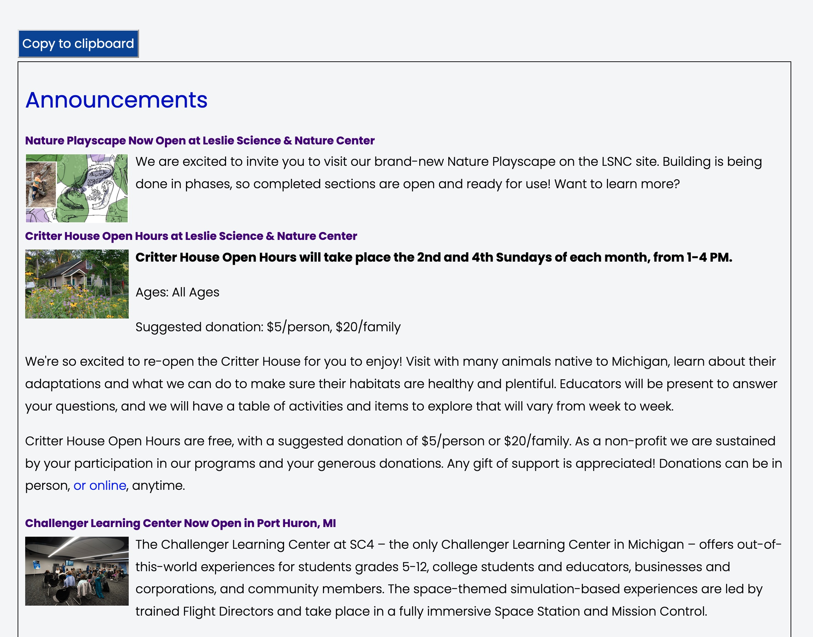

### MailChimp Interface

Outputs HTML code to be pasted into a MailChimp campaign

**Used On Pages**


**Usage**

*collectionControl(Selector, Collection Slug, Display Type, Attributes)*

**Parameters:**

<table class="ws-table-all notranslate">
  <tbody>
    <tr class="tableTop">
     <td style="width:120px">Parameter</td>
     <td>Description</td>
    </tr>
    <tr>
      <td><em>Selector</em></td>
      <td>Required.<br>jQuery selector identification where the resulting html code will be generated.  Note that the selector must be unique on the page.</td>
    </tr>
    <tr>
      <td><em>Collection Slug</em></td>
      <td>Comma delimited list of collection slugs to use.</td>
    </tr>
    <tr>
      <td><em>Display Type</em></td>
      <td>Required.<br>Identifies the display type requested.  For MailChimp must be "mailchimp".  This is a case sensitive parameter. </td>
    </tr>
    <tr>
      <td><em>Attributes</em></td>
      <td>Optional.<br>Identifies parameters to override default values.  The parameters are passed in a object array of key/value pairs.  Each display type has different default values as described below. </td>
    </tr>
  </tbody>
</table>

**Attributes:**

All attributes are optional, the defaults are defined.

<table class="ws-table-all notranslate">
  <tbody>
    <tr class="tableTop">
     <td style="width:120px">Attribute</td>
     <td>Description</td>
     <td>Default</td>
    </tr>
    <tr>
     <td>FindCats</td>
     <td>A comma delimited string of categories to include.</td>
     <td>&nbsp;</td>
    </tr>
  </tbody>
</table>

**Example code block for control**

```
<script>
$(document).ready(function() {
  collectionControl(
  	'#mailChimpWrapper',
    'announcements, outreach-1',
     'mailchimp'
  );
})
</script>
<div id="target">
</div>
<div id="mailChimpWrapper"></div>
```

**Note:** the backtic usage in "findcats".  Using the backtic, instead of quote,
allows us to use multiple lines more easily.

**Reference Data**

None


**Overrides:**

None

**Return Value:**

None

**MailChimp view**

{: .theImage}
