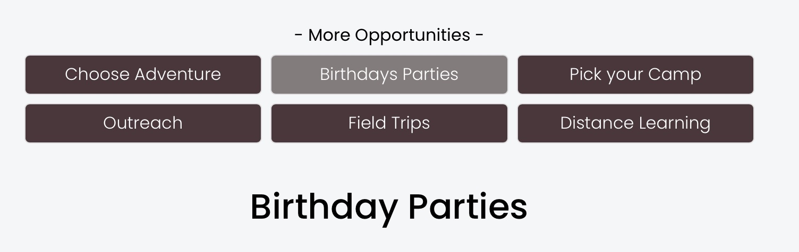

### Menu Bar

Menu bar for sub-menu items.  These are found on the "Learn" pages to help navigation between learn pages.  On mobile devices the menu is an wrapped in an accordion and compressed by default to save some space. 

***Cook book***
- Edit the page
- Click a "+" sign where you want to insert 
- Select "Code"
- Paste the following code block
- Adust parameters as needed

```
<script> 
$(document).ready(function() {
   subMenuBar('#subMenu','adventure');
});
</script>
<div id="subMenu"></div>
```

**Usage:**

*subMenuBar(SelectorID, Active)*

**Parameters:**

<table class="ws-table-all notranslate"> 
  <tbody>
    <tr class="tableTop">
     <td style="width:120px">Parameter</td>
     <td>Description</td>
    </tr>
    <tr>
      <td>
        SelectorID
      </td>
      <td>Required.<br>The selector to contain the menu bar (default = '#subMenu').
      </td>
    </tr>
    <tr>
      <td>Active</td>
      <td>Optional.<br>The active button choice. (default = '')
      	<ul>
      		<li>adventure</li>
      		<li>birthdays</li>
      		<li>camp</li>
      		<li>outreach</li>
      		<li>field</li>
      		<li>distance</li>
      	</ul>
      </td>
    </tr>
    
  </tbody>
</table>

**Return Value:**

None

**Menu Bar Screenshot**

{: .theImage}