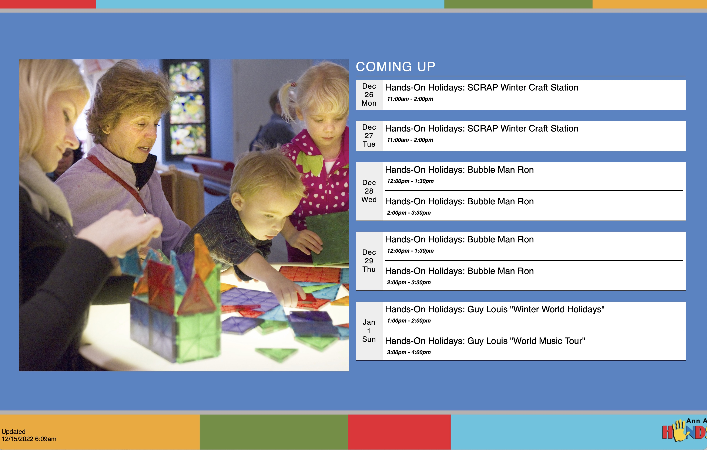

### Signage Display

Display Google calendar on signage display in lobby 

**Used On Pages**

*signage-test*

**Usage**

*collectionControl(Selector, Collection Slug, Display Type, Attributes)*

**Parameters:**

<table class="ws-table-all notranslate">
  <tbody>
    <tr class="tableTop">
     <td style="width:120px">Parameter</td>
     <td>Description</td>
    </tr>
    <tr>
      <td><em>Selector</em></td>
      <td>Required.<br>jQuery selector identification where the resulting html code will be generated.  Note that the selector must be unique on the page.</td>
    </tr>
    <tr>
      <td><em>Collection Slug</em></td>
      <td>No defined collection is needed, leave blank.</td>
    </tr>
    <tr>
      <td><em>Display Type</em></td>
      <td>Required.<br>Identifies the display type requested.  For signage display must be "signage".  These are case sensitive parameters. </td>
    </tr>
    <tr>
      <td><em>Attributes</em></td>
      <td>Optional.<br>Identifies parameters to override default values.  The parameters are passed in a object array of key/value pairs.  Each display type has different default values as described below. </td>
    </tr>
  </tbody>
</table>

**Attributes:**

All attributes are optional, the defaults are defined.

<table class="ws-table-all notranslate">
  <tbody>
    <tr class="tableTop">
     <td style="width:120px">Attribute</td>
     <td>Description</td>
     <td>Default</td>
    </tr>
    <tr>
      <td><em>Refresh</em></td>
        <li>Integer number of minutes to wait and refresh data from calendar</li>
      <td>Default = 60 minutes</td>
    </tr>
    <tr>
      <td><em>Slick</em></td>
        <li>Enables or disables the carousel sliding of happening today box.  This
        only impacts the display if enough events happen on the current day
      to cause it to overflow.</li>
      <td>"Yes" = enabled, "No" = disabled</td>
    </tr>
    <tr>
      <td><em>Speed</em></td>
        <li>Integer number of seconds for the carousel to move to the next slide</li>
      <td>default = 10 seconds</td>
    </tr>
    <tr>
      <td><em>Fontsize</em></td>
        <li>Numeric multiplier to increase font size</li>
      <td>default = 1</td>
    </tr>
  </tbody>
</table>

**Example code block for control**

```
<!-- Digial signage -->
<script type="text/javascript" src="https://cdn.jsdelivr.net/gh/AAHOM/UIL@03b73c5/signage.min.js"></script>
<link rel='stylesheet' href="https://cdn.jsdelivr.net/gh/AAHOM/UIL@7b1f01d/signage.min.css" />
<script>
$(document).ready(function() {

	// Add the ID we need to build the page from 
  $('body').prepend('<div id="signageDiv"></div>');
  // Hide the SquareSpace content
  $('#siteWrapper').hide();  

	collectionControl(
		'#signageDiv',
		'',
		'signage',
		{ 
			refresh: 60, 
			slick: 'yes',
			speed: 10} ); 
  })
</script>
```

**NOTE:** The previous code block needs to go into the page "Advanced" section, rather than embeded as a code block on the page content, as others are done.   This is because the code completely removes the page content and replaces with custom html code.  

**Overrides:**

You can dynamically override defaults by adding a parameter to the linking url as:

```
date=mm/dd/yy (set current date)
refresh=n  (where n is a number of minutes)
slick=yes (where value is "yes" or "no", default is "yes", enabled)
speed=n (where n is a number of seconds)
fontsize=n (where n is an multiplier number, default is 1)
```

**Example URL with Overrides**

```
https://discoverscienceandnature.org/signage-test?date=12/31/22&speed=10&refresh=1
```

**Reference Data**

*reference-data blog: Signage Display (Images)*

*Images* Currently the code recognizes two images on the Signage Display blog page.   These images are positional.   The first one is the default image to display if no events are found for the current day.   The second image is the transparent backgound image.  


**Example Screenshot**

{: .theImage}
