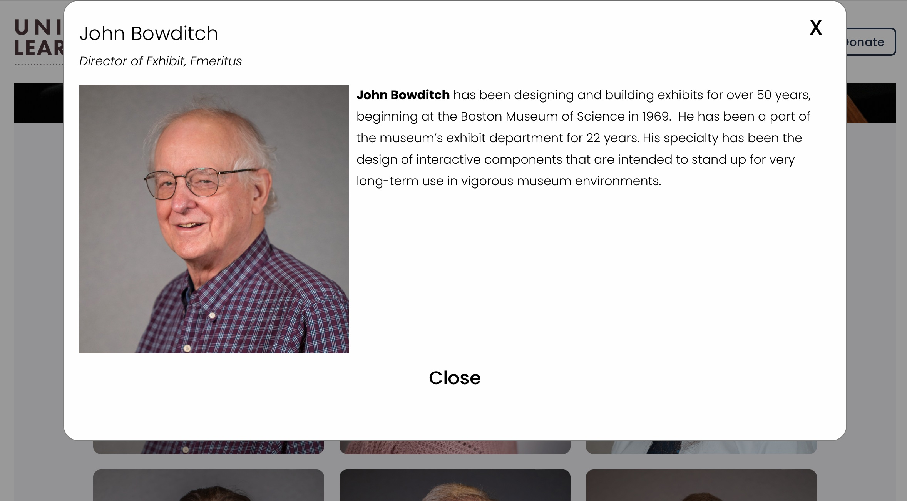

### Team Members Custom Display

A list of team members found in the SquareSpace blog "Team Members" can be displayed via the custom function ***collectionControl*** by embedding a code block on a page as follows:

### Quick try

Paste the following into a SquareSpace code block to see how it works:

```
<script>
$(document).ready(function() {
  collectionControl(
    '#teamContainer',
    'team-members',
    'team'
  );
})
</script>
<div id="teamContainer"></div>
```

**Used On Pages**

*About Us -> People*

**Usage**

*collectionControl(Selector, Collection Slug, Display Type, Attributes)*

**Parameters:**

```
<script>
$(document).ready(function() {
  collectionControl(
    '#teamContainer',
    'team-members',
    'team', 
    {filter: false, 
     showcount: false,
     groups: '',
     showcats: false,
     findcats: '',
     dots: false}
  );
})
</script>
<div id="teamContainer"></div>
```

Attribute defaults specific to the ***team-members*** collection are: 

<table class="ws-table-all notranslate"> 
  <tbody>
    <tr class="tableTop">
     <td style="width:120px">Attribute</td>
     <td>Description</td>
     <td>Default</td>
    </tr>
    <tr>
      <td>filter</td>
      <td>Defines if filtering checkboxes (or radio buttons) are to be displayed.  Valid values are "true" or "false".  </td>
      <td>false</td>
    </tr>
    <tr>
      <td>groups</td>
      <td>Overrides the default groups used for filtering.  This is a comma delimeted
      list of group names found in the categories spreadsheet.</td>
      <td>''</td>
    </tr>
    <tr>
      <td>showcats</td>
      <td>Defines if categories are shown for each blog entry. Valid values
      are "true" or "false".</td>
      <td>false</td>
    </tr>
    <tr>
      <td>showcount</td>
      <td>Defines if a count of filtered and total number of blog items is shown. Valid values are "true" or "false"</td>
      <td>false</td>
    </tr>
    <tr>
      <td>findcats</td>
      <td>Defines a comma delimted list of categories which will be included
      in the blog entries.</td>
      <td>''</td>
    </tr>
  </tbody>
</table>

To make changes, edit the individual team members blog entry.  The order displayed is based on the default order within the blog, which is driven by the publication date. The team member postion is defined as a "Tag" entry in the blog entry settings. 

### Team Members Backup Plan

In the event that the ***collectionControl*** function fails, or does not work due to changes in SquareSpace, or unforseen problems.  Replace the code block with a standard 
summary block defined as follows: 

***Cook book***
- Edit the page
- Click a "+" sign where you want to insert 
- Select "Summary"
- Under "Content"
  - Select a Page = Team Members
  - Primary MetaData = "Tags"
  - Secondary MetaData = None
  - Filter Items = no categories selected
- Under "Design"
  - Select "Grid"
  - Aspect Radio = 2:3 Standard (Vertical)
  - Text = M, left adjusted
  - Title = On
  - Featured Image = On
  - Excerpt = On
  - Read More Link = On
  - Metadata Position = Below Title
  - Under "Size and Spacing"
    - Column Width = 190px
    - Gutter Width = 60px
    - Use Column numbers.. = Off
- Save changes


**Example Screenshot**

{: .theImage}

**Team member detail**

{: .theImage}

**Team Backup Summary Block**

{: .theImage}